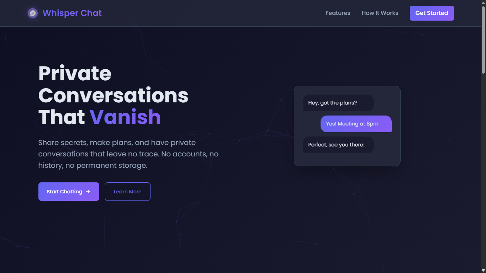
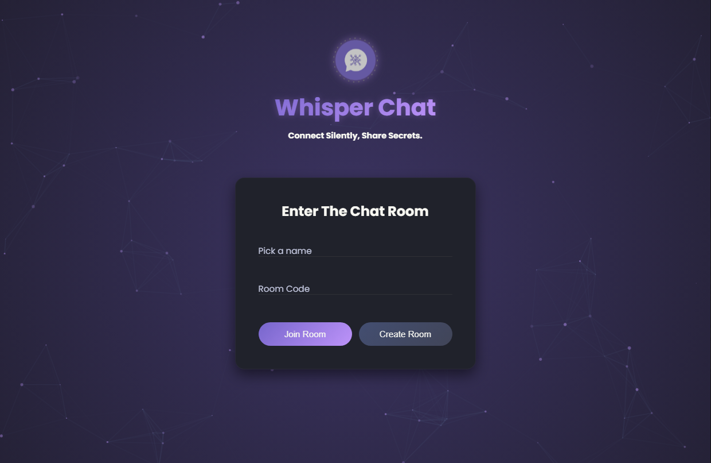
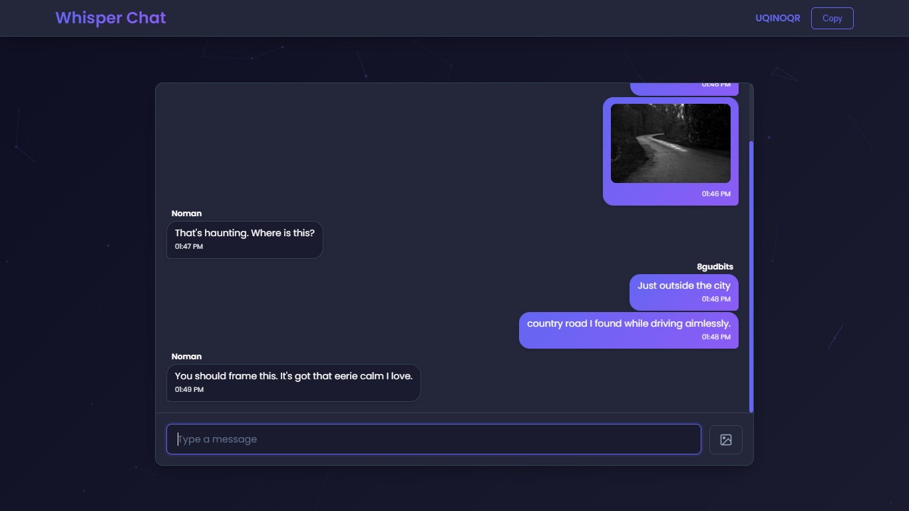
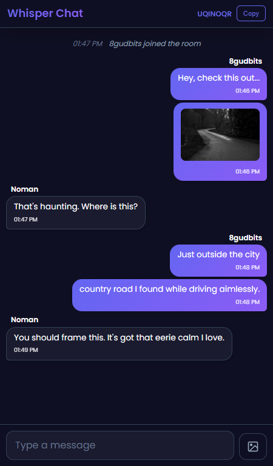

<h1 align="center">WhisperChat</h1>

  

**Self-hostable real-time messaging application that allows users to communicate in multiple chat rooms on a single server using unique room codes.**

## Features

- Ephemeral Messaging - Messages are delivered in real-time and never stored on servers
- Private Room System - Create secure chat rooms with unique, shareable codes
- Media Sharing - Send and view images with full-screen navigation and zoom controls
- Real-time Communication - Instant messaging by Socket.IO
- Zero Configuration - No accounts or registration required for users
- Instant Client Setup - Start chatting immediately with just a name

## Screenshots

